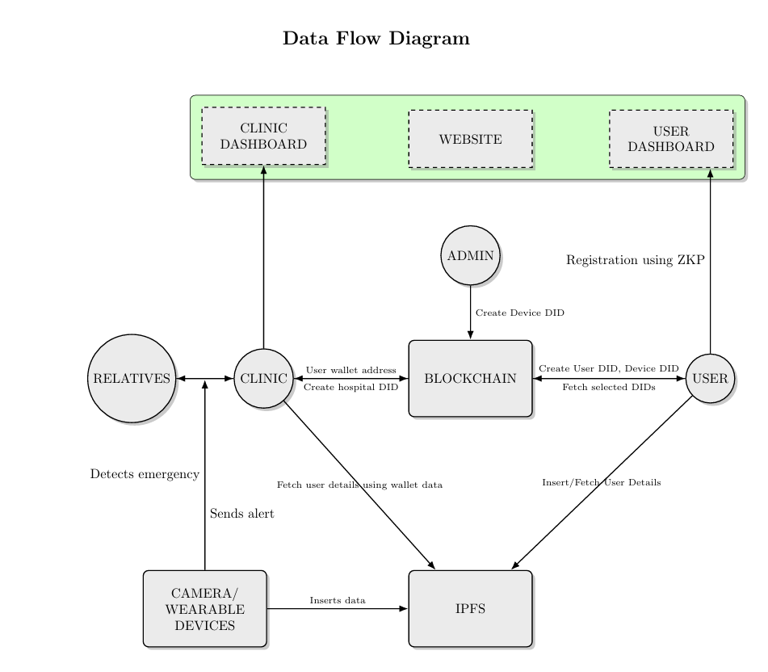
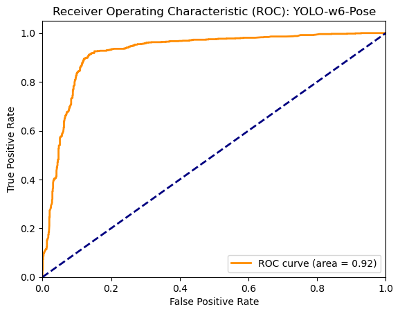
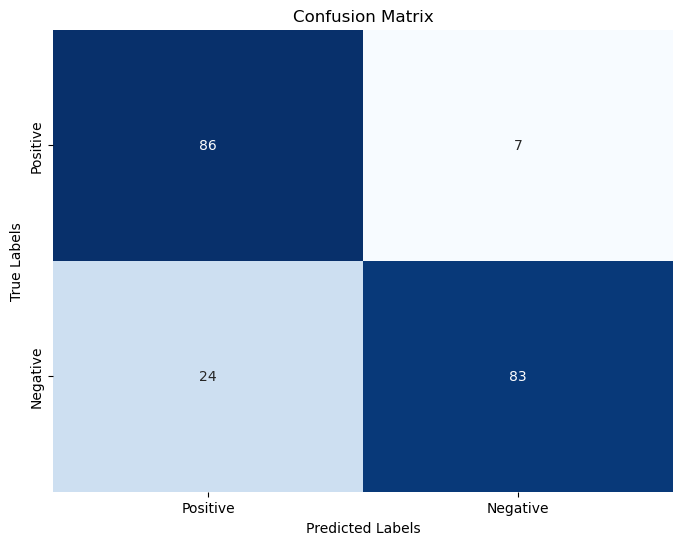

# Introduction

A collaborative project between CUSAT and Homomorphic Software Pvt Ltd with a grant from Ethereum foundation.

<<<<<<< HEAD
=======
## Purpose of each module:

# metasave-fe
A client side for both user & hospital. 
User can view their fall details/close contacts/profile/hospital/devices.

# metasave-be
This handles all the functionalities like authentication/fall data/whatsapp messages to close contacts/user data/communicating with blockchain & IPFS/etc.

# metasave-contracts
This handles all the functionalities related to the smart contracts on the blockchain.

# Model
This contains the code for the YOLOv7-W6-Pose model, code for the Nano BLE Arduino script, and the python script to simulate a fall using the wearable device or the camera.

>>>>>>> b08c9e3204e301c000ece0b62c41b7e84b39c958
## Data Flow Diagram

Below is the Data Flow Diagram (DFD) that outlines the flow of data across the system:



## YOLOv7-W6-Pose Model

### Base Model Performance: 
1. Resolution: 1280
2. Average Precision (AP): 54.9%
3. Recall: 25.1%
4. Train/Box Loss: 1.8%
5. Train/Class Loss: 0.0%
6. Train/Object Loss: 0.6%
7. Val/Box Loss: 2.8%
8. Val/Class Loss: 0.0%
9. Val/Object Loss: 1.5%
10. Learning rate: 0.00447
11. AP50 (50% IoU): 72.6%
12. AP75 (75% IoU): 60.1%
13. Average fps: ~10
14. Latency: ~100 ms

### Metrics:
1. Cohen's Kappa Score: 0.69
2. Accuracy: 84.5%




<<<<<<< HEAD
## Installation

This project uses a monorepo structure that includes both front-end and back-end components. To get started, run the following commands:

```bash
# Install dependencies for both front-end and back-end
npm install

# Run the front-end development server
npm run dev-fe

# Run the back-end development server
npm run dev-be

# Run camera (currently on laptop)
npm dev-camera

# Run odroid
npm dev-odroid
```
=======
>>>>>>> b08c9e3204e301c000ece0b62c41b7e84b39c958

# Project Setup Guide

## Prerequisites

### For Both Windows and Linux

1. **Python**: 
   - Ensure you have Python installed. You can download it from [Python's official website](https://www.python.org/downloads/).

2. **Pip**: 
   - Pip should be installed with Python, but you can ensure it's up-to-date by running the following command:
     ```bash
     python -m ensurepip --upgrade
     ```

3. **CUDA (for GPU users)**:
   - If you have an Nvidia GPU and want to use CUDA, you need:
     - A CUDA-capable GPU
     - A supported version of Linux/Windows with a gcc compiler and toolchain
     - NVIDIA CUDA Toolkit: [CUDA Downloads](https://developer.nvidia.com/cuda-downloads)
   - Check your GPU driver version with:
     ```bash
     nvidia-smi
     ```
   - Install or update your Nvidia drivers if necessary from: [Nvidia Drivers](https://www.nvidia.com/en-us/drivers/).

  3. **NODE JS**:
    - Use Node v20.16.0 throughout the project
     ```bash
     nvm install 20.16.0
     nvm use 20.16.0
     node -v
     ```

### Install PyTorch

- **CPU Only**:
  ```bash
  conda install pytorch==2.3.1 torchvision==0.18.1 torchaudio==2.3.1 cpuonly -c pytorch
  ```
- **GPU and CPU (choose from either versions which are compatible with your current GPU model)**:
  
  **CUDA 11.8**  
  ```bash
  conda install pytorch==2.3.1 torchvision==0.18.1 torchaudio==2.3.1 pytorch-cuda=11.8 -c pytorch -c nvidia
  ```
  **CUDA 12.1**  
  ```bash
  conda install pytorch==2.3.1 torchvision==0.18.1 torchaudio==2.3.1 pytorch-cuda=12.1 -c pytorch -c nvidia
  ```

### Install External Libraries

- **Install dependencies**:
    ```bash
    pip install -r packages/model/requirements.txt
    ```

    ```bash
    npm install
    ```

### Setting Up Camera Device

- **Any USB port camera with a resolution of 1080*1920 or less should work. In the working directory, navigate to:**
    ```bash
    packages/model/camera.py
    ```

- **Ensure that the following line in the script is as is:**
   ```bash
    cap = cv2.VideoCapture(0)
    ```

0 is default for the system's native camera. You can set the value inside the VideoCapture function to other numbers, which represent additional peripherically connected cameras.

<<<<<<< HEAD
### Setting Up Wearable Device (optional)

The camera.py script is capable of execution even if the wearable device isn't connected. But if you would like to set it up, follow this procedure:

- **Navigate to the ```packages/model/odroid.py``` script**
- **Retrieve the MAC Address of the Wearable Device and add it to the ```ADDRESS``` field**
- **Usually the ```SERVICE_UUID``` and the ```CHAR_UUID``` are default, but if making any changes (optional), you will have to update the same values in these fields in the ```packages/model/nano_ble.ino``` script**
- **Push the updated script to the Arduino board**

That's it, you're all set to go

## Purpose of each module:

# Frontend
A client side for both user & hospital. 
User can view their fall details/close contacts/profile/hospital/devices.

# Backend
This handles all the functionalities like authentication/fall data/whatsapp messages to close contacts/user data/communicating with blockchain & IPFS/etc.

# Camera
This is the code that's supposed to run inside the camera. It detects a fall and sends the details to the backend.

# Odroid
This regularly listens for data from the wearable device. If it detects a fall, it also sends the details to the backend.
=======
### Setting Up Wearable Device & Simulating a Fall

The camera.py script is capable of execution even if the wearable device isn't connected. But if you would like to set it up, follow this procedure:

- **Navigate to the ```packages/model/listenDevice.py``` script**
- **Change the ```SERIAL_PORT``` to the port your Arduino board is connected to**
- **Change the ```DEVICE_ADDRESS``` to the MAC address of your Arduino board**
- **Change the ```BAUD_RATE``` to the baud rate of your Arduino board**
- **Navigate to the ```packages/model/nano_ble_wired.ino``` script**
- **Upload the script to the Arduino board**
- **Change the directory back to the root of the project and run the following commands:**
    ```bash
    npm run dev-listen
    ```

That's it, you're all set to go

### Simulating a Fall with the camera

- **Navigate to the ```packages/model/camera.py``` script**
- **Change the ```SERIAL_PORT``` to the port your Arduino board is connected to**
- **Change the ```DEVICE_ADDRESS``` to the MAC address of your Arduino board**
- **Change the ```BAUD_RATE``` to the baud rate of your Arduino board**
- **Navigate to the ```packages/model/nano_ble_wired.ino``` script**
- **Upload the script to the Arduino board**
- **Change the directory back to the root of the project and run the following commands:**
    ```bash
    npm run dev-camera

    ```

### Simulating a Fall without a camera or wearable device

- **Change the directory back to the root of the project and run the following commands:**
    ```bash
    npm run dev-apitest
    ```

## Installation & Running the Project

This project uses a monorepo structure that includes both front-end and back-end components. To get started, run the following commands:

```bash
# Install dependencies for both front-end and back-end
npm install

# Run the front-end development server
npm run dev-fe

# Run the back-end development server
npm run dev-be
```
>>>>>>> b08c9e3204e301c000ece0b62c41b7e84b39c958
